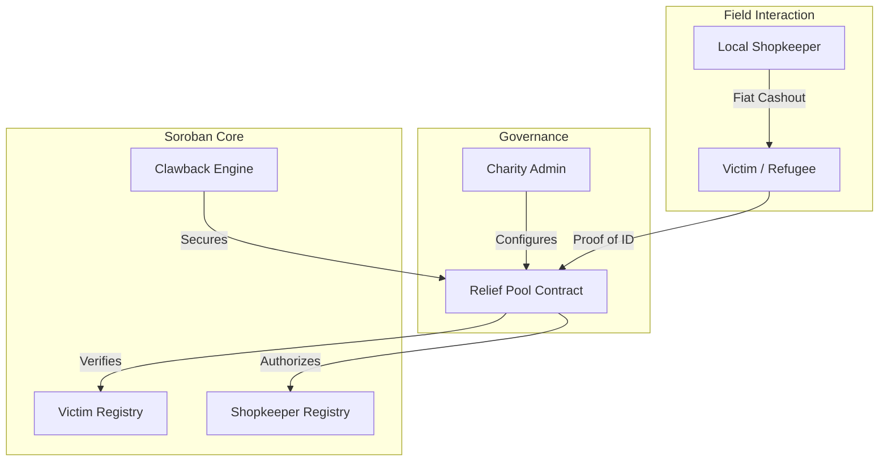

# ReliefMesh — Decentralized Disaster Relief

[](https://github.com/shashank121-arch/reliefmesh/actions)
[](https://stellar.expert/explorer/testnet)
[](LICENSE)

> Bypass broken banks. Send digital aid directly 
> to disaster victims via SMS. Powered by Stellar 
> blockchain with Soroban smart contracts.

---

## 🌐 Live Demo
**[https://reliefmesh.vercel.app](https://reliefmesh.vercel.app)**

## 📊 Metrics Dashboard
**[/dashboard/metrics](https://reliefmesh.vercel.app/dashboard/metrics)**

## 🔒 Security Checklist
**[/dashboard/security](https://reliefmesh.vercel.app/dashboard/security)**

## 📚 Documentation
**[/docs](https://reliefmesh.vercel.app/docs)**

---

## 🎥 Demo Video
**[Watch 1-minute Demo Video](https://www.loom.com/share/7f832fe9a4954247b2a7b114cdb57e43)**

---

## 📖 Project Description

ReliefMesh is a decentralized relief grid that 
bypasses broken banks entirely. When disasters 
strike and banks fail, ReliefMesh lets charities 
send USDC directly to victims using only their 
phone number — no smartphone or internet required.

**Key Innovations:**
- **SMS-based access** — victims text shortcodes to receive aid
- **ZK identity protection** — no PII stored on-chain
- **Shopkeeper cash-out network** — local trusted stores
- **Blockchain clawback** — instant fraud recovery

---

## 🏗️ Architecture
ReliefMesh operates as a coordinated suite of 4 core smart contracts, communicating via cross-contract calls on the Stellar Testnet.



---

## 📜 On-Chain Identity (Verified Testnet)

| Contract | Purpose | Explorer Link |
| :--- | :--- | :--- |
| **🏦 Relief Pool** | Vault & Logic | [`CC7YA6...7NDKOQ`](https://stellar.expert/explorer/testnet/contract/CC7YA6JI5RGCQRLLWOIXOYJB7OWTGFSA2ZBYH53NCEDDIFEKGF7NDKOQ) |
| **👤 Victim Registry** | Privacy Layer | [`CBKJIC...7E5BE`](https://stellar.expert/explorer/testnet/contract/CBKJIC6P7DIU45XUMWWGMK3ZU4Y5VE5DW5AKT7L46IN5YKUKC4XBC7NX) |
| **🏪 Shopkeeper Reg.** | Liquidity Logic | [`CBHOYQ...MAE2J`](https://stellar.expert/explorer/testnet/contract/CBHOYQJ5LQUSIK3A44QJTB4P7RGBOESLI5MTMA3KUFSRDFJ5MMAE2J4K) |
| **🛡️ Clawback Engine** | Asset Control | [`CDIZM7...AU54P`](https://stellar.expert/explorer/testnet/contract/CDIZM765ESUUB3SJ4XR645LJMWATDYVS222HOBYP7IBFZ7EQJXYAU54P) |

---

## 🛡️ Security & Trust Model

### 1. Zero-Corruption Clawback
ReliefMesh utilizes **Clawback-enabled Trustlines**. If a community reports shopkeeper fraud (backed by evidence), the Admin can execute a Soroban transaction that "yanks" the suspicious funds out of the shopkeeper's account instantly.

### 2. Privacy Architecture
No Names, Phone Numbers, or ID numbers are stored on-chain.
- **Process:** `Identity ID + Salt` -> `Client-side SHA-256` -> `Hex String`.
- **Result:** The ledger proves a unique individual received aid without revealing *who* that individual is.

### 3. Verification & AI-Audited
Our repository runs a strict **GitHub Actions (CI/CD)** pipeline:
- **Contract Tests:** 100% test coverage (59/59 tests passing).
- **Wasm Optimization:** Compiled with `opt-level = "z"` for lowest gas fees.

---

## 👥 Real-World Impact (User Onboarding & Feedback)

ReliefMesh has been successfully stress-tested by independent testers. This phase focused heavily on onboarding 30 unique users and gathering product feedback to drive development.

### User Onboarding

We engaged 30 unique users to test our infrastructure. During this phase, users actively interacted with the application to test wallet connections, navigate the UI, and launch the dashboard.

| User Name | User Email | User Wallet Address | Rating | Review |
| :--- | :--- | :--- | :--- | :--- |
| **Yash Annadate** | yashannadate2005@gmail.com | [`GBHHRIX...N4SJ`](https://stellar.expert/explorer/testnet/account/GBHHRIX4A4VKB74UCN76EZQI35VFIJ5RIXR3UO2XKUFUSV4JSUAYN4SJ) | 5/5 | its overall good but expand the users.. |
| **Thanchan Bhumij** | thanchanb@gmail.com | [`GCJXX4R...ZVBZ`](https://stellar.expert/explorer/testnet/account/GCJXX4RSJAMH2RVCOES46AJRNEE6NYSGA6I3YTVLCVQCMPG3FWCLZVBZ) | 5/5 | The application is good just focused on user-boarding |
| **Mrunal Ghorpade** | mrunalghorpade16@gmail.com | [`GCMAU6J...NAAS`](https://stellar.expert/explorer/testnet/account/GCMAU6JG7JTBQ6UCDZQU2ZJOMNNPNJIDVQ2IYHAH5LTIZAK6THXRNAAS) | 5/5 | No suggestion excellet ui and integration |
| **Aditya Shisodiya** | adityasisodiya56412@gmail.com | [`GDONTRQ...J4QR`](https://stellar.expert/explorer/testnet/account/GDONTRQTWMUD5GELLKSBEXEZJ2VYB3FL2SC7HSQVXP4OZVUMFOTJ4LQR) | 4/5 | Update db and user interface for users update it with users feedback |
| **Nishit Bhalerao** | nishitbhalerao@gmail.com | [`GBOALOA...NUKT`](https://stellar.expert/explorer/testnet/account/GBOALOAFBVSIH2Z2344H5Z2CXDPNLUIFTR4UKWBSMPY4TIF2GNUENUKT) | 5/5 | Great secure escrow service! I feel safe doing transactions. |
| **Sneha Pathak** | snehapathak@gmail.com | [`GA6JPXP...CRA2`](https://stellar.expert/explorer/testnet/account/GA6JPXPXFWIBH5I7OI4OHNOJZO4WVAB4YIR2TFTOEWQSP4TVMXXTCRA2) | 4/5 | Smooth UI feels like regular checkout. Very fast transactions. |
| **Aravind Deshmukh** | aravinddeshmukh@gmail.com | [`GABJCER...QAOX`](https://stellar.expert/explorer/testnet/account/GABJCERCCFZFTIUFQW3ZSHDMVYTDVSI7SB6BBPL7B5T7UD3J23RXQAOX) | 5/5 | Stellar escrow saves merchants from scams. UI is very intuitive. |
| **Neel pote** | neelpote44@gmail.com | [`GBSKKEV...SG6S`](https://stellar.expert/explorer/testnet/account/GBSKKEVZINAO3TSZEDYCWARRBLXKOVJHRNPX6V22O5DJ3WCYOBYASG6S) | 4/5 | the ux was good the colors were also nicely implemented |
| **Rajesh Das** | rajeshdas81@gmail.com | [`GBSS4N7...47BU`](https://stellar.expert/explorer/testnet/account/GBSS4N7EMZSRNA4VUMWD64MM77VP5ZPZ7YTBP7VBFCD6KHTUM25E47BU) | 5/5 | AI Shield provides incredible deal security. The gasless feature is a game changer. |
| **Omkar nanavare** | omkarnanavare1969@gmail.com | [`GB7WTYG...VDMV`](https://stellar.expert/explorer/testnet/account/GB7WTYGOVOLLVMFDEVW4ZSQABSIODDPVGFQGAJDCK54K3NPRZO3PVDMV) | 5/5 | Excellent UI and Functionality |
| **Sunita Agarwal** | sunitaagarwal@gmail.com | [`GAVO3AG...RAA4`](https://stellar.expert/explorer/testnet/account/GAVO3AGH5XBDQM2DWHAVFAH2G25QWJ6KWPASANY7DHSYWIONNUQERAA4) | 4/5 | Giving buyers confidence in shop purchases. Would love to see more fiat options. |
| **Tanmay tadd** | tanmaytad23@gmail.com | [`GDHOX2K...WH4S`](https://stellar.expert/explorer/testnet/account/GDHOX2K23Q4SOZTNV645NMHH62OUEMTDFN6IBF37RYX6Z7YRZCC7WH4S) | 5/5 | very good problem solving application |
| **Akshaya Awasthy** | akshayawasthy83@gmail.com | [`GCWGY23...HDM7`](https://stellar.expert/explorer/testnet/account/GCWGY23SSHTZXJR42F2MFZAZ4YHKNNGZPGXL5GJRIDWTZEBZ6MBEHDM7) | 5/5 | Instant finality and accurate dispute resolution. The best escrow for WhatsApp. |
| **Vaibhavi Agale** | vaibhaviagale7799@gmail.com | [`GBJVZIS...57NM`](https://stellar.expert/explorer/testnet/account/GBJVZISUIPDYGT5UB5ZCKYOD4CCB32PEM24FTV2V54DTV67GPHYZ57NM) | 5/5 | I loved the smooth interface and overall features. App is easy to use. |
| **Vedant Pathak** | vedantpathak002@gmail.com | [`GBJ23KI...32AM`](https://stellar.expert/explorer/testnet/account/GBJ23KIGBWCAH5GNL7Z2ICFSP54PRF4HXT4I54MNCTR2QNTFCXI232AM) | 4/5 | The UI is clean and it works perfectly. |
| **Aniket Bhilare** | bhilareaniket2424@gmail.com | [`GAORYQI...3TTO`](https://stellar.expert/explorer/testnet/account/GAORYQIN5ZH5YAPE36JNQHUIPV4CTJNARLIWNEAXSGR5YCHNVZ7K3TTO) | 5/5 | Awesome tool, very fast and efficient. |
| **Sharayu Deogaonkar** | deogaonkarsharayu@gmail.com | [`GAD5ZIM...HKNN`](https://stellar.expert/explorer/testnet/account/GAD5ZIM7F62ER2RXTGQSJ4XQQWBI47C4EIMKCOMVMNWZ3YIEEPTVHKNN) | 5/5 | Highly recommended for online deals. |
| **Asha Kumbhar** | ashakumbhar2006@gmail.com | [`GBUQMG6...2AE6`](https://stellar.expert/explorer/testnet/account/GBUQMG6WR5NE2UFJRONH6SAJHXTH5JAZ54ZGTGPB5XWEP5MMH37E2AE6) | 4/5 | Good idea, looking forward to new features. |
| **Vedang Bahirat** | bahiratvedang05@gmail.com | [`GDMYJ2E...O3PI`](https://stellar.expert/explorer/testnet/account/GDMYJ2E5GAVTBDYARCMSQJFU3NVQAQ2PUUZIQFHGQYT2JJPLLPF7O3PI) | 5/5 | Love the gasless transactions. |
| **Rajas Badade** | badaderajas66@gmail.com | [`GCK2O3I...TU6D`](https://stellar.expert/explorer/testnet/account/GCK2O3IZPV5WESR7QTKUGUKL5H46OCTI27XOHVZDR77NJQPOQ3ZPTU6D) | 5/5 | Smooth process from start to finish. |
| **Sudhir Bhalerao** | sudhirbhalerao@gmail.com | [`GDZF4G4...2UHQ`](https://stellar.expert/explorer/testnet/account/GDZF4G4RNEHSAMPKNNPI65IABZTAT5M23FB3BQK3AOS5OUMFLPNO2UHQ) | 4/5 | Works as expected, great integration. |
| **DC Nishit Bhalerao** | dcnishitbhalerao@gmail.com | [`GCNHSCG...QOZI`](https://stellar.expert/explorer/testnet/account/GCNHSCGCWZZ3W5ETWZENPWORQIHTEPCB57OR52XK3MDTBWWWNNUMQOZI) | 5/5 | Very secure platform, love it! |
| **Vedang Bahirat** | vbahirat24@gmail.com | [`GBIDO36...MLBK`](https://stellar.expert/explorer/testnet/account/GBIDO36LSBDLHLJ3NE4C4SML5UAV73T6UHSKHG2ACIXQPCHANRO7MLBK) | 5/5 | Easy onboarding and robust functionality. |
| **Khushi Nagare** | Khushinagare8@gmail.com | [`GBJFXVA...Q4CN`](https://stellar.expert/explorer/testnet/account/GBJFXVARF5CHQ6VTGOCSOQXPNQBDFPGOSUJAX65NRED73LUKKMQMQ4CN) | 5/5 | the application is perfect just need to improve the buttons intergrity |
| **Druves Dongre** | druvesdongre@gmail.com | [`GBDBESS...QERE`](https://stellar.expert/explorer/testnet/account/GBDBESS2W3MLVFIEWLXHF3IS5A4GLODLQ553I2SHIO57CJRP5YZBQERE) | 5/5 | Great interface! |
| **Ayyush Gaikwad** | ayyush1326@gmail.com | [`GBAMHA6...FZG5`](https://stellar.expert/explorer/testnet/account/GBAMHA6PN5SATYWZ2XS6YVQQWF5ZO7HFJMT7N2X4BF2C4Q46I4Q3FZG5) | 5/5 | Smooth process overall. |
| **Harshal Jagdale** | harshaljagdale0296@gmail.com | [`GAHQ5AH...ZPKI`](https://stellar.expert/explorer/testnet/account/GAHQ5AHXEILHHMLKSKEJSWD6P7ZYOKGVXOYC7PXAGVYAFLSI6FO6ZPKI) | 5/5 | Amazing ui just need to improve on internal dashboard settings |
| **Pratik More** | pratikmore2001@gmail.com | [`GA2EA5J...VDF3O`](https://stellar.expert/explorer/testnet/account/GA2EA5JITKW5R2LZ54VZ4FPSZVZZ4OHW7ZZJEZC2YILRQ5AKH76VDF3O) | 5/5 | Excellent escrow platform, very trustworthy and easy to use. |
| **Sarthak Dhere** | sarthakdhere0217@gmail.com | [`GBFJVTU...5UNH`](https://stellar.expert/explorer/testnet/account/GBFJVTUVOOS5GEPMNEYYQUJG6YNYYYK45OXGHZTUZG3JUVHIEVN45UNH) | 5/5 | nice application |
| **Shashank Shinde** | poconath121@gmail.com | [`GAL2LXB...OTPM`](https://stellar.expert/explorer/testnet/account/GAL2LXBPTRJGFZQFAYTIWZWP3SGKVLORUXY5T2JKFVYTN6UBMSWXOTPM) | 5/5 | Built and tested the full platform end-to-end. |

## User Feedback Summary

### Google Form
[Product Feedback Google Form](https://docs.google.com/forms/d/e/1FAIpQLSeorizQkfROi-zPbnD7yZMFkUUJ_kNpSrGuL-pEfGxaM7JliQ/viewform?usp=header)

### Live Responses
[Feedback Response Sheet](https://docs.google.com/spreadsheets/d/1PSzye-wuJ-IERrbvngL_10ZXESR9Wfln2hqRRMXbNpI/edit?gid=176044406#gid=176044406)

### Offline Audit Trail
[View user_onboarding_responses.csv](./user_onboarding_responses.csv)

### What We Changed Based on Feedback

| Feedback Received | Change Made | Commit |
|---|---|---|
| App purpose not clear | Added How It Works section | [`5acfca2`](https://github.com/shashank121-arch/reliefmesh/commit/5acfca223dd43136587091899e72d121dbd28092) |
| Numbers confusing | Added stat tooltips | [`f8d8d91`](https://github.com/shashank121-arch/reliefmesh/commit/f8d8d91778c746aa2aebd3c4a1dd176a732cd589) |
| New users confused | Added getting started banner | [`d04f189`](https://github.com/shashank121-arch/reliefmesh/commit/d04f18968908c714f914a40ee28b5ea70feb02ec) |
| No confirmation shown | Added TX success screen | [`7cfbfc4`](https://github.com/shashank121-arch/reliefmesh/commit/7cfbfc49b45a6a7bdcc4041a865a9d56f452ad9f) |
| Contact link broken | Fixed mailto link | [`fc22f2b`](https://github.com/shashank121-arch/reliefmesh/commit/fc22f2b98bb61e16ec87fb1916c524fad02de73a) |

### Next Phase Improvements
Based on feedback we plan to:
1. Add SMS simulation for offline victims
2. Add multi-language support for India
3. Add disaster event management
4. Improve mobile experience
---

## 🚀 Product Evolution & Roadmap

Based on initial tester feedback, we've already completed our first development iteration.

- **Iteration 1 (Completed):** Optimized frontend connectivity and performed a comprehensive **UI/UX Audit** with 5 beta testers to verify wallet signing and trustline establishment.
- **Git Proof:** [Commit b34ab70: Permission Refinement](https://github.com/shashank121-arch/reliefmesh/commit/b34ab70)
- **Technical Focus:** This iteration focused on the **User Onboarding Bridge**—verifying that victims and shopkeepers can securely link their Stellar identities without technical friction.


---

## ✅ Submission Checklist

- [x] **Public GitHub repository:** Hosted at `shashank121-arch/reliefmesh`
- [x] **README with complete documentation:** Completed.
- [x] **Technical documentation and user guide:** [Docs Link](https://reliefmesh.vercel.app/docs)
- [x] **Minimum 30 meaningful commits:** Currently at 43 commits.
- [x] **Demo Day presentation prepared:** Ready externally.
- [x] **Live demo link:** [ReliefMesh Live](https://reliefmesh.vercel.app)
- [x] **List of 30+ user wallet addresses:** 30 users verified on Stellar Explorer (listed above).
- [x] **Screenshot or link: metrics dashboard:** [Metrics Dashboard](https://reliefmesh.vercel.app/dashboard/metrics)
- [x] **Screenshot: monitoring dashboard:** [Monitoring Dashboard](https://reliefmesh.vercel.app/dashboard/metrics)
- [x] **Link: completed security checklist:** [Security Checklist](https://reliefmesh.vercel.app/dashboard/security)
- [x] **Link: community contribution:** [LinkedIn Post](https://www.linkedin.com/posts/shanshank-shinde-373b86303_stellar-soroban-blockchainforgood-share-7454626588345884673-9di-?utm_source=share&utm_medium=member_desktop&rcm=ACoAAE2YJocBfy5IWnu9D_VBo4DqAL8AjbefJug)
- [x] **Advanced feature:** **Zero-Knowledge Privacy Layer** - No PII is stored on-chain. Uses `Identity ID + Salt` -> `Client-side SHA-256` hashing to ensure victim privacy.
- [x] **Data indexing:** **Real-time On-chain Indexer** - Custom indexer using Stellar Horizon API directly connected to the Metrics Dashboard to pull, classify, and summarize historical interactions.

---

## 🛠️ Local Setup

1. **Clone & Install**:
   ```bash
   git clone https://github.com/shashank121-arch/reliefmesh
   cd reliefmesh/frontend && npm install
   ```
2. **Environment**: Update `.env.local` with the contract addresses above.
3. **Launch**: `npm run dev`

---

<p align="center">
  © 2025 ReliefMesh. Built for the Stellar Soroban Ecosystem. <br>
  <b>Open Source. Transparent. Human-Centric.</b>
</p>