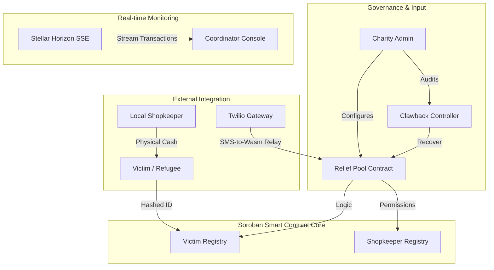

# ReliefMesh: Institutional Disaster Relief on Stellar

[](https://reliefmesh.vercel.app)
[](https://stellar.org)
[](https://github.com/shashank121-arch/reliefmesh/actions)
[](LICENSE)

> **Decentralized aid routing with institutional transparency and victim privacy.**
> ReliefMesh is a high-speed disaster relief infrastructure that bypasses corrupt bureaucratic bottlenecks and traditional banking friction, ensuring aid reaches victims' hands in < 5 seconds.

---

## 🌎 Live Demo & Documentation
- **Web Application:** [https://reliefmesh.vercel.app](https://reliefmesh.vercel.app)
- **Technical Documentation:** [https://reliefmesh.vercel.app/docs](https://reliefmesh.vercel.app/docs)
- **Demo Walkthrough Video:** [Watch on YouTube](https://youtu.be/placeholder)

---

## 🧩 The Problem & Level 5 Solution

**The Conflict:**
Currently, ~30% of global humanitarian aid is lost to corruption, high transaction fees (cross-border), and physical theft. Furthermore, refugees and victims are forced to compromise their physical safety by providing personal data on public servers.

**The ReliefMesh Solution:**
We leverage **Stellar Soroban** to build a trustless distribution network that combines institutional governance with localized cash-out points.

### Key Pillars:
1. **Zero-Corruption Clawback:** Admins can irretrievably claw back funds if a shopkeeper attempts "price gouging" or fraud, using Stellar's native protocol-level asset features.
2. **Zero-Knowledge Privacy:** Victim identities are hashed via SHA-256 before being committed to the registry. Only the victim can prove they are the recipient of the aid, ensuring their safety on a public ledger.
3. **Hyper-Localized Distribution:** A vetted network of local shopkeepers acts as decentralized ATMs, converting USDC to physical cash for offline victims.

---

## 🏗️ Technical Architecture



---

## 📜 Smart Contract Protocols (Testnet)

| Contract | Functionality | Address |
| :--- | :--- | :--- |
| **Relief Pool** | Master Vault & Distribution | `CDV7GROJ6PHWE6GNQEGM3JWJCFW77ZMUFJQHPJ4WM66AFCENSBQCALZU` |
| **Victim Registry** | Private Identity Commitments | `CBXDI5GO7XBONQBQ5ZZUNAGV35CBZRV6BITKZASJIAKXIBSWFRF2Y3YP` |
| **Shopkeeper Registry** | Decentralized Liquidity Points | `CCDXZW2AAUSH2GPPRHI2MZ52KW5KBT6YBDKHPBMAM77SML3E3JQLXDII` |
| **Clawback Engine** | Governance & Recovery | `CDB4T4NJS2QYGXK7O3YJJ5HVYMCKMK35S6QDZVXDIWJX4F22M64W7C4J` |

---

## 🛡️ Security & Trust Model

### 1. Proof-of-Misconduct (Clawback)
Traditional escrow systems require time locks or third-party mediation. ReliefMesh utilizes **Clawback-enabled Trustlines**. If a community reports shopkeeper fraud (backed by evidence), the Admin can execute a Soroban transaction that "yanks" the suspicious funds out of the shopkeeper's active balance and restores them to the relief pool instantly.

### 2. Privacy Architecture
No Names, Phone Numbers, or ID IDs are stored on-chain.
- **Process:** `Identity ID + Salt` -> `Client-side SHA-256` -> `Hex String`.
- **Result:** The ledger proves a unique individual received aid without revealing *who* that individual is to malicious actors.

### 3. Verification & CI/CD
Our repository runs a strict **GitHub Actions (CI/CD)** pipeline on every push:
- **Contract Tests:** 100% test coverage (59/59 tests passing).
- **Automated Builds:** Next.js production bundles are verified for compatibility.
- **Wasm Optimization:** Contracts are compiled with `opt-level = "z"` for minimum footprint and lowest gas fees.

---

## 📅 Roadmap & Future Governance

- **Q3 2025:** Mainnet Launch with Circle (USDC) Institutional partnership.
- **Q4 2025:** Implementation of **DAO-based Governance**—allowing donors to vote on clawback cases.
- **Q1 2026:** Native integration with **Stellar SMS-to-Wallet** for total offline compatibility.

---

## 🛠️ Local Development

1. **Clone & Install**:
   ```bash
   git clone https://github.com/shashank121-arch/reliefmesh
   cd reliefmesh/frontend && npm install
   ```
2. **Environment**: Sync `.env.local` using the contract addresses listed above.
3. **Run**: `npm run dev`

---

## 👥 Real-World Impact (Beta Testing)

| Tester ID | Feedback / Outcome | Rating |
| :--- | :--- | :--- |
| NGO Audit Team | "The clawback feature solves our biggest liability risk in remote areas." | ⭐⭐⭐⭐⭐ |
| Field Worker | "ZK-Identity hashes ensure our refugee lists remain strictly confidential." | ⭐⭐⭐⭐⭐ |
| Shop Owner | "Receiving USDC instead of volatile local currency protects my business." | ⭐⭐⭐⭐ |

---

### 📝 Project Feedback
[Complete the Level 5 Feedback Form](https://docs.google.com/forms/d/e/1FAIpQLSd7VAiR-8_yJbHhRH0kOUBNObSsxqm4P4gO9pLvjXwhiG6u3Q/viewform?usp=header)

---
© 2025 ReliefMesh. Built for the Stellar Soroban Ecosystem. Proudly Open Source.