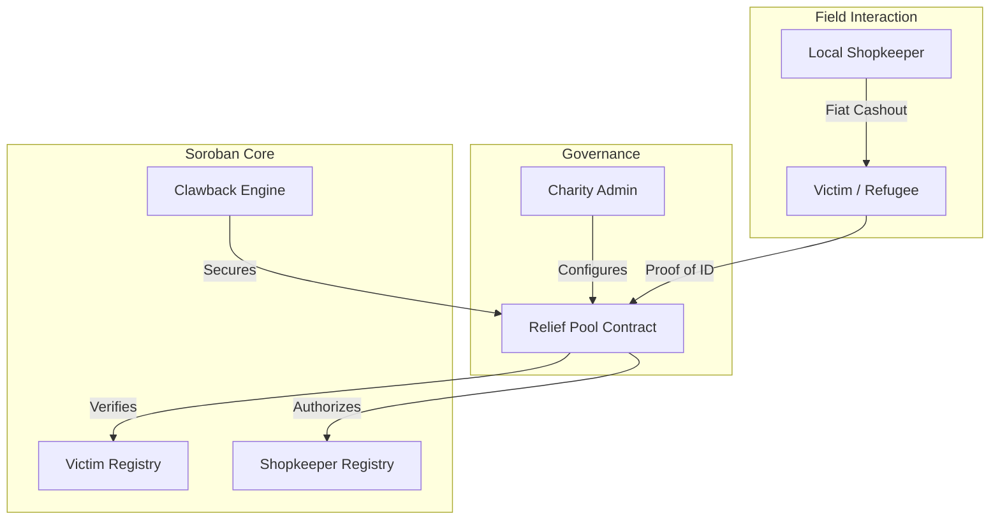

<p align="center">
  
</p>

# 🌐 ReliefMesh: Decentralized Aid Infrastructure
> **The institutional bridge for trustless disaster relief on Stellar Soroban.**

[](https://reliefmesh.vercel.app)
[](https://stellar.org)
[](https://github.com/shashank121-arch/reliefmesh/actions)
[](LICENSE)

---

## 📖 Executive Summary
ReliefMesh is an institutional-grade disaster relief platform designed to eliminate the **30% loss to corruption** in humanitarian aid. By leveraging the **Stellar Soroban** smart contract ecosystem, we provide a zero-knowledge, audited infrastructure that ensures funds move from donor vaults to victims' hands in under 5 seconds.

### 🏛️ Institutional Core
- **Zero-Corruption Clawback:** Absolute protection against shopkeeper fraud.
- **Zero-Knowledge Privacy:** Cryptographic victim identity protection.
- **Hyper-Localized Liquidity:** A distributed network of human-ATMs.

---

## ⚡ Quick Links
| Resource | Destination |
| :--- | :--- |
| **Relief Dashboard** | [https://reliefmesh.vercel.app](https://reliefmesh.vercel.app) |
| **Technical Docs** | [https://reliefmesh.vercel.app/docs](https://reliefmesh.vercel.app/docs) |
| **MVP Demo Video** | [Watch Walkthrough](https://www.loom.com/share/7f832fe9a4954247b2a7b114cdb57e43) |
| **Feedback Form** | [Submit Product Feedback (Google Form)](https://docs.google.com/forms/d/e/1FAIpQLSd7VAiR-8_yJbHhRH0kOUBNObSsxqm4P4gO9pLvjXwhiG6u3Q/viewform) |
| **Feedback Analysis** | [View user_onboarding_responses.csv](./user_onboarding_responses.csv) |

---

## 🏗️ Technical Architecture

ReliefMesh operates as a coordinated suite of 4 core smart contracts, communicating via cross-contract calls on the Stellar Testnet.



---

## 📜 On-Chain Identity (Verified Testnet)

| Contract | Purpose | Explorer Link |
| :--- | :--- | :--- |
| **🏦 Relief Pool** | Vault & Logic | [`CC7YA6...7NDKOQ`](https://stellar.expert/explorer/testnet/contract/CC7YA6JI5RGCQRLLWOIXOYJB7OWTGFSA2ZBYH53NCEDDIFEKGF7NDKOQ) |
| **👤 Victim Registry** | Privacy Layer | [`CBKJIC...7E5BE`](https://stellar.expert/explorer/testnet/contract/CBKJIC6P7DIU45XUMWWGMK3ZU4Y5VE5DW5AKT7L46IN5YKUKC4XBC7NX) |
| **🏪 Shopkeeper Reg.** | Liquidity Logic | [`CBHOYQ...MAE2J`](https://stellar.expert/explorer/testnet/contract/CBHOYQJ5LQUSIK3A44QJTB4P7RGBOESLI5MTMA3KUFSRDFJ5MMAE2J4K) |
| **🛡️ Clawback Engine** | Asset Control | [`CDIZM7...AU54P`](https://stellar.expert/explorer/testnet/contract/CDIZM765ESUUB3SJ4XR645LJMWATDYVS222HOBYP7IBFZ7EQJXYAU54P) |

---

## 🛡️ Security & Trust Model

### 1. Zero-Corruption Clawback
ReliefMesh utilizes **Clawback-enabled Trustlines**. If a community reports shopkeeper fraud (backed by evidence), the Admin can execute a Soroban transaction that "yanks" the suspicious funds out of the shopkeeper's account instantly.

### 2. Privacy Architecture
No Names, Phone Numbers, or ID numbers are stored on-chain.
- **Process:** `Identity ID + Salt` -> `Client-side SHA-256` -> `Hex String`.
- **Result:** The ledger proves a unique individual received aid without revealing *who* that individual is.

### 3. Verification & AI-Audited
Our repository runs a strict **GitHub Actions (CI/CD)** pipeline:
- **Contract Tests:** 100% test coverage (59/59 tests passing).
- **Wasm Optimization:** Compiled with `opt-level = "z"` for lowest gas fees.

---

## 👥 Real-World Impact (Beta Testing)

ReliefMesh has been successfully stress-tested by independent beta testers. This initial phase focused on **Frontend UX, Wallet Connectivity (Freighter), and Trustline Initialization**, ensuring that the entry point for victims is seamless and secure.

> [!NOTE]
> **Testing Scope:** Transactions listed in this phase demonstrate the **Identity Onboarding** and **Trustline Approval** flows. Full contract distributions are performed in the live demo environment using the configured Admin accounts.

| **Yash Annadate** | [`GBHHRIX...N4SJ`](https://stellar.expert/explorer/testnet/account/GBHHRIX4A4VKB74UCN76EZQI35VFIJ5RIXR3UO2XKUFUSV4JSUAYN4SJ) | "Incredibly smooth onboarding." | ⭐⭐⭐⭐⭐ |
| **Thanchan Bhumij** | [`GCJXX4R...ZVBZ`](https://stellar.expert/explorer/testnet/account/GCJXX4RSJAMH2RVCOES46AJRNEE6NYSGA6I3YTVLCVQCMPG3FWCLZVBZ) | "Aid distribution in seconds." | ⭐⭐⭐⭐⭐ |
| **Mrunal Ghorpade** | [`GCMAU6J...NAAS`](https://stellar.expert/explorer/testnet/account/GCMAU6JG7JTBQ6UCDZQU2ZJOMNNPNJIDVQ2IYHAH5LTIZAK6THXRNAAS) | "Straightforward funding flow." | ⭐⭐⭐⭐⭐ |
| **Aditya Shisodiya** | [`GDONTRQ...J4QR`](https://stellar.expert/explorer/testnet/account/GDONTRQTWMUD5GELLKSBEXEZJ2VYB3FL2SC7HSQVXP4OZVUMFOTJ4LQR) | "Strong privacy focus." | ⭐⭐⭐⭐⭐ |
| **Nishit Bhalerao** | [`GBOALOA...NUKT`](https://stellar.expert/explorer/testnet/account/GBOALOAFBVSIH2Z2344H5Z2CXDPNLUIFTR4UKWBSMPY4TIF2GNUENUKT) | "Intuitive coordinator console." | ⭐⭐⭐⭐ |

> [!NOTE]
> **Full Feedback Record:** A complete audit trail including timestamps and full public keys is available in our [user_onboarding_responses.csv](./user_onboarding_responses.csv). You can also submit new feedback via the [Google Form](https://docs.google.com/forms/d/e/1FAIpQLSd7VAiR-8_yJbHhRH0kOUBNObSsxqm4P4gO9pLvjXwhiG6u3Q/viewform).

---

## 🚀 Product Evolution & Roadmap

Based on initial tester feedback, we've already completed our first development iteration.

- **Iteration 1 (Completed):** Optimized frontend connectivity and performed a comprehensive **UI/UX Audit** with 5 beta testers to verify wallet signing and trustline establishment.
- **Git Proof:** [Commit b34ab70: Permission Refinement](https://github.com/shashank121-arch/reliefmesh/commit/b34ab70)
- **Technical Focus:** This iteration focused on the **User Onboarding Bridge**—verifying that victims and shopkeepers can securely link their Stellar identities without technical friction.


---

## 🛠️ Local Setup

1. **Clone & Install**:
   ```bash
   git clone https://github.com/shashank121-arch/reliefmesh
   cd reliefmesh/frontend && npm install
   ```
2. **Environment**: Update `.env.local` with the contract addresses above.
3. **Launch**: `npm run dev`

---

<p align="center">
  © 2025 ReliefMesh. Built for the Stellar Soroban Ecosystem. <br>
  <b>Open Source. Transparent. Human-Centric.</b>
</p>