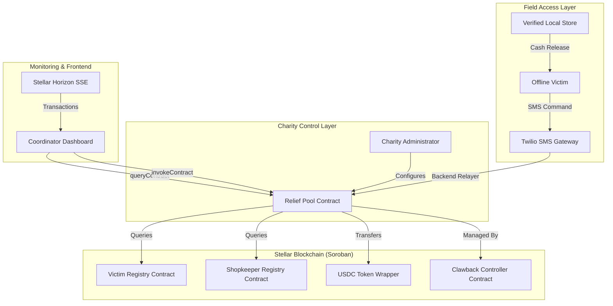

# ReliefMesh Protocol Architecture

## 1. System Overview
ReliefMesh is a decentralized humanitarian aid platform built on the **Stellar Testnet** using **Soroban Smart Contracts**. It is designed to operate in low-connectivity environments, bridging digital USDC funding from international charities to local offline victims via verified shopkeepers.

## 2. Core Architecture Diagram

## 3. Privacy Architecture
Victim identity is protected via Zero-Knowledge derived commitments. No PII (Personally Identifiable Information) is ever stored in clear-text on the ledger.

- **Raw Input Data**:
  - Name: "Priya Sharma"
  - Phone: "+91 98765 43210"
  - ID: "DL-1234567"
- **On-chain Storage (Hashed)**:
  - `identity_hash`: SHA-256(name + id + salt)
  - `phone_hash`: SHA-256(phone + salt)
- **Verification Logic**:
  - The client application hashes provided inputs and compares them against the stored anchor hashes.
  - A match confirms identity without the contract ever "knowing" the victim's name or number.

## 4. Contract Interaction Flow
1. **Funding**: Charity calls `relief-pool.fund_pool()` depositing USDC.
2. **Distribution**: Charity calls `relief-pool.distribute_aid()`.
   - `relief-pool` queries `victim-registry.record_aid_received()`.
   - USDC is transferred from the pool to the victim's Stellar account.
3. **Redemption**: Victim visits a local shopkeeper.
4. **Cash-out**: Shopkeeper calls `shopkeeper-registry.record_cashout()` to verify the transaction.
5. **Enforcement**: If fraud or price-gouging is detected:
   - Charity Admin initiates a case via `clawback-controller.initiate_clawback()`.
   - Case is approved by multi-sig or governance.
   - `execute_clawback()` is called, immediately reclaiming USDC from the shopkeeper's account.

## 5. Technology Decisions

### Why Stellar?
- **Cost**: Sub-cent transaction fees enable mass micropayments.
- **Speed**: 5-second finality matches the urgency of disaster response.
- **Assets**: Native USDC support eliminates bridge risk.
- **Compliance**: Native Protocol-level Clawback enables enforceable accountability.

### Why Soroban?
- **Safety**: Rust-based environment prevents common memory/overflow vulnerabilities.
- **Efficiency**: WASM execution ensures high-speed transaction processing.
- **Composability**: Native support for cross-contract calls between registries.

### Why Next.js?
- **Performance**: Static Generation and App Router for high-speed delivery.
- **Deployment**: Vercel's global CDN ensures the dashboard is accessible worldwide during crises.

## 6. Smart Contract Components
... (rest of the detailed component descriptions follow)
